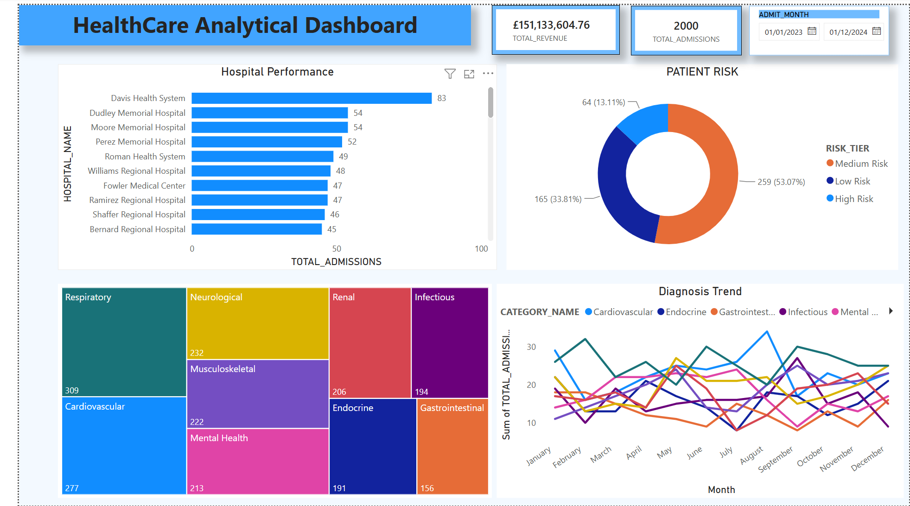

# HealthTrack Analytics Pipeline

> End-to-end Data Engineering project: AWS S3 → Snowpipe → Snowflake → dbt → Power BI

A production-grade healthcare data pipeline demonstrating modern data stack patterns — dimensional modeling, SCD types, incremental loading, automated tests, and BI dashboards.

---

## Architecture

```
┌──────────────┐    ┌──────────┐    ┌──────────┐    ┌─────┐    ┌─────────┐
│ Python       │ →  │ AWS S3   │ →  │ Snowpipe │ →  │ dbt │ →  │ Power BI │
│ (faker data) │    │ data lake│    │ AUTO     │    │     │    │         │
└──────────────┘    └──────────┘    │ INGEST   │    └─────┘    └─────────┘
                                    └──────────┘

RAW → STAGING → CORE (dims + fact) → MARTS → POWER BI

---

## Tech Stack

- **Python** — synthetic healthcare data generation (Faker)
- **AWS S3** — data lake with date partitioning
- **Snowflake** — cloud data warehouse + Snowpipe + Tasks
- **dbt Cloud** — transformations, tests, snapshots, semantic layer
- **Power BI** — business dashboards
- **GitHub** — version control with GitFlow

---

## What's Inside
healthtrack-analytics-pipeline/

├── data_generation/         # Python scripts to generate + upload data

├── snowflake/              # SQL setup scripts (RBAC, Snowpipe, etc)

├── models/

│   ├── staging/            # Cleaned source data (views + incremental)

│   ├── core/               # Star + snowflake schema (dims + fact)

│   ├── marts/              # BI-ready aggregations

│   └── semantic/           # dbt Semantic Layer metrics

├── snapshots/              # SCD Type 2 snapshots

├── seeds/                  # Reference data (dim_date)

├── tests/                  # Custom singular tests

├── macros/                 # Reusable SQL functions

├── powerbi/                # Dashboard .pbix + screenshots

└── sql_practice/           # SQL exercises for students


---

## Key Concepts Demonstrated

### dbt
- All 4 materializations: `view`, `table`, `incremental`, `ephemeral`
- Generic tests: `not_null`, `unique`, `accepted_values`, `relationships`
- Singular tests with custom business rules
- Sources with freshness checks
- Snapshots for SCD Type 2
- Packages, macros, seeds

### Dimensional Modeling
- **Star schema** — 4 dimensions + 1 fact table
- **Snowflake schema** — `dim_diagnosis` → `dim_icd_category`
- **SCD Type 1** — `dim_hospital` (overwrite history)
- **SCD Type 2** — `dim_patient` (preserve history with snapshot)
- Surrogate keys via MD5 hashes
- Clustering on fact table for query performance

### Snowflake
- Snowpipe AUTO_INGEST with SQS event notifications
- Time Travel for data recovery
- Zero-copy cloning for safe dev environments
- Scheduled Tasks with audit logging
- RBAC roles (TRANSFORMER, REPORTER)
- ACCOUNT_USAGE views for cost monitoring

### Production Patterns
- Layered architecture (raw → staging → core → marts)
- Environment variables for secrets (.env files)
- GitFlow with feature branches
- Conventional commits

---

## Dashboard



Power BI dashboard built on top of marts layer:
- Hospital performance (admissions, revenue, LOS)
- Diagnosis category trends over time
- Patient risk scoring (High/Medium/Low tiers)

---

## SQL Practice

Hands-on SQL exercises in the [`sql_practice/`](./sql_practice/) folder:

- **01_window_functions.sql** — ROW_NUMBER, RANK, LAG, LEAD, running totals
- **02_qualify_examples.sql** — QUALIFY clause, GROUPING SETS, PIVOT
- **03_healthcare_patterns.sql** — 30-day readmission, LOS, cohort analysis

Each file includes example queries against the project data + practice exercises.

---

## Repository Stats

- **Models**: 14 (4 staging + 5 core + 3 marts + 1 ephemeral + 1 snapshot)
- **Tests**: 30+ generic + 1 singular + 4 relationship tests
- **Schemas**: RAW, STAGING, CORE, MARTS, SNAPSHOTS

---

## Author

**Priyanka Pandey**  
Data Engineering transition project  
GitHub: [@data-24](https://github.com/data-24)

---

## License

MIT — feel free to use this as a learning reference.